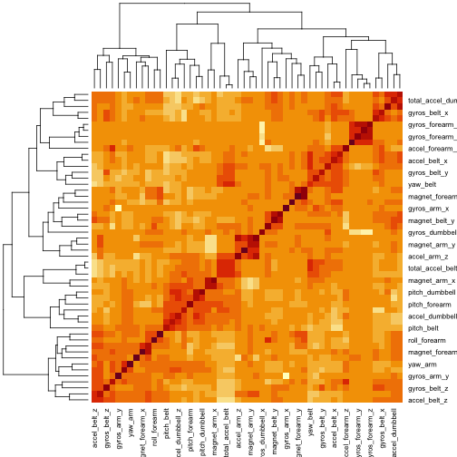

# Activity Prediction of Weight Lifting Exercises  

Doris Chen  
2023-02-16  

### Prepare

**Loading the data**


```r
url_train <- "https://d396qusza40orc.cloudfront.net/predmachlearn/pml-training.csv"
download.file(url_train, destfile="/Users/Doris/Desktop/PML_Prediction/pml-training.csv", method="curl")
pml_training <- read.csv("pml-training.csv")

url_test <- "https://d396qusza40orc.cloudfront.net/predmachlearn/pml-testing.csv"
download.file(url_test, destfile="/Users/Doris/Desktop/PML_Prediction/pml-testing.csv", method="curl")
pml_testing <- read.csv("pml-testing.csv")
```
  
**Loading packages**  
  

```r
library(caret)
library(ranger)
```
  
### Process  
  
Check the dimension and the column names of the data.  


```r
dim(pml_training)   
names(pml_training)
head(pml_training) # Results are hidden.
```
  
There are 19622 observations of 160 variables. Some columns with "NA" values and some with blank values.  
  
We convert blank values to "NA", then check the total missing values in the data.    
  

```r
pml_training[pml_training==""] <- NA
colSums(is.na(pml_training))   
sum(colSums(is.na(pml_training))==19216) # Results are hidden.
```
  
There are 100 columns containing "NA", each are 19216. We remove these columns together with column 1 to 7, which are not data from the accelerometers.  
  

```r
training <- pml_training[colSums(is.na(pml_training))==0]
training <- training[,-c(1:7)]
```
    
We perform the same process on test set.   
  

```r
pml_testing[pml_testing==""] <- NA
testing <- pml_testing[colSums(is.na(pml_testing))==0]
testing <- testing[,-c(1:7)]
```
  
### Fit the model  
  
**1. Preprocess the data**  

Check the correlation between variables.  
  

```r
corr <- cor(training[,-53])
heatmap(corr)
```


  
The heatmap shows that there are some highly correlated variables. We'll check how many of them have the correlation coefficient greater than 0.8.


```r
unique(corr[abs(corr)>0.8 & abs(corr)!=1])
```

```
##  [1]  0.8152297  0.9809241  0.9248983 -0.9920085 -0.9657334 -0.8841727  0.9278069
##  [8] -0.9749317  0.8920913 -0.9333854 -0.9181821  0.8142732  0.8144455  0.8082885
## [15]  0.8491322 -0.9789507 -0.9144764  0.9330422  0.8455626
```
  
19 pairs of variables have correlation greater than 0.8. So we preprocess the data with principal components analysis.    
  

```r
set.seed(1)
prep <- preProcess(training[,-53], method="pca", thresh = 0.99)
trainPC <- predict(prep, training[,-53])
trainPC$classe <- as.factor(training$classe)
```
  
Preprocess the test set.  
  

```r
testPC <- predict(prep, testing[,-53])
testPC$problem_id <- testing$problem_id
```
  
**2. Cross validation setting**        
  
We use k-fold for cross validation, set k=3.  
  

```r
train_control<- trainControl(method="cv", number=3, classProbs=TRUE)
```
  
**3. Train the model**     
  
Our goal is to predict the type of activities, so we use random forest to train the model.
  

```r
fit <- train(classe ~., data=trainPC, method="ranger", trControl=train_control) # Results are hidden
```
   
**4. Check the prediction accuracy**
  

```r
confusionMatrix(predict(fit, trainPC), trainPC$classe)
```

```
## Confusion Matrix and Statistics
## 
##           Reference
## Prediction    A    B    C    D    E
##          A 5580    0    0    0    0
##          B    0 3797    0    0    0
##          C    0    0 3422    0    0
##          D    0    0    0 3216    0
##          E    0    0    0    0 3607
## 
## Overall Statistics
##                                      
##                Accuracy : 1          
##                  95% CI : (0.9998, 1)
##     No Information Rate : 0.2844     
##     P-Value [Acc > NIR] : < 2.2e-16  
##                                      
##                   Kappa : 1          
##                                      
##  Mcnemar's Test P-Value : NA         
## 
## Statistics by Class:
## 
##                      Class: A Class: B Class: C Class: D Class: E
## Sensitivity            1.0000   1.0000   1.0000   1.0000   1.0000
## Specificity            1.0000   1.0000   1.0000   1.0000   1.0000
## Pos Pred Value         1.0000   1.0000   1.0000   1.0000   1.0000
## Neg Pred Value         1.0000   1.0000   1.0000   1.0000   1.0000
## Prevalence             0.2844   0.1935   0.1744   0.1639   0.1838
## Detection Rate         0.2844   0.1935   0.1744   0.1639   0.1838
## Detection Prevalence   0.2844   0.1935   0.1744   0.1639   0.1838
## Balanced Accuracy      1.0000   1.0000   1.0000   1.0000   1.0000
```
  
The accuracy is 100%.  

**5. Estimate out of sample error**  
  

```r
fit$finalModel
```

```
## Ranger result
## 
## Call:
##  ranger::ranger(dependent.variable.name = ".outcome", data = x,      mtry = min(param$mtry, ncol(x)), min.node.size = param$min.node.size,      splitrule = as.character(param$splitrule), write.forest = TRUE,      probability = classProbs, ...) 
## 
## Type:                             Probability estimation 
## Number of trees:                  500 
## Sample size:                      19622 
## Number of independent variables:  36 
## Mtry:                             36 
## Target node size:                 1 
## Variable importance mode:         none 
## Splitrule:                        extratrees 
## Number of random splits:          1 
## OOB prediction error (Brier s.):  0.04427669
```
  
The OOB prediction error is 0.044. So the estimated out of sample error is 4.4%  
  
### Predict on test set  
  

```r
predict(fit, testPC[,-37])
```

```
##  [1] B A B A A E D B A A B C B A E E A B B B
## Levels: A B C D E
```
  


